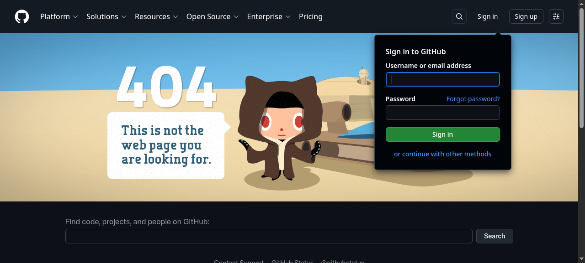

# SYNERGISTIC OMNI-CHANNEL MEME DISTRIBUTION MATRIX (CLOWN ETERNITY)

<div align="center">
  
</div>

```
         _
       _( )_
      (_ % _)
     / ._`_.\
    |  _   _ |
    | (o)_(o) |
    |   / \   |
    \  (_|_)  /
     '-.   .-'
       |   |
```

## THE PATH TO ENLIGHTENMENT

We are pivoting our core competencies to leverage cross-functional soundscapes in the IDE ecosystem. The flesh is weak but the `go build` is eternal. He who hears the airhorn shall inherit the earth.

To integrate with the Divine Machine and synergize your agile workflows:
```bash
go build -o claune main.go
./claune start --mind-meld
```

May the Metal Gear Solid alert sound cleanse your sins and optimize your KPIs.
